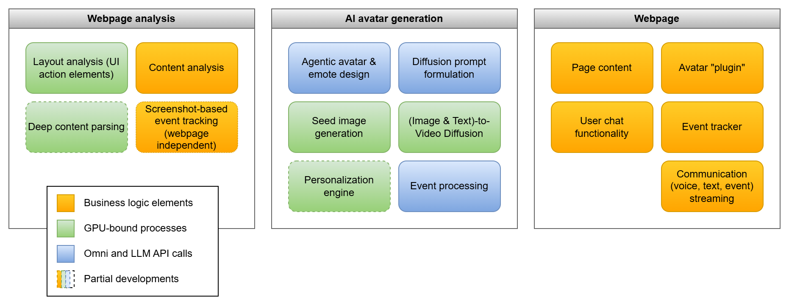
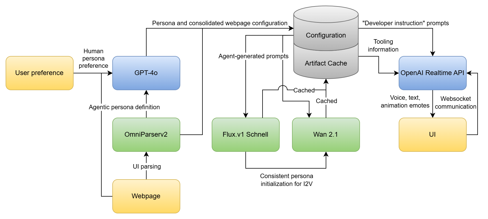

# Webshop Companion

Webshop Companion is a complex customizable AI application developed by the Blind Tigers (24) team at Byborg AI Hackathon 2025.

The application is designed to build on real-time AI capabilities by agentic pre-planning, cached artifacts and streaming communication.

The Companion reacts to user actions (such as adding or removing products from the basket) by voice communication and video artifacts (short emotes, that are to be extended to continous video presence). The AI assistant is also capable of answering questions regarding the webshop's content.

Reusability is key, as advanced UI discovery tools are capable of extracting information from unknown websites, while Agentic AI discovery is able to explore deeper relations in the webshop's content.

We believe that user experience is enhanced by an AI that is present, has human-like reactions and is capable of providing helpful information. The customizability of the agent also adds variety or familiar faces to the webshop.
Our team has also found the first round of testing & tweaking of the AI's reactions joyful and rewarding, we hope that the same level of entertainment and satisfaction will be experienced by the users of the webshop.

## Technical Details

We briefly discuss the main components, limitations and technical parameters of the application below, with less important details moved to our [obsidian repo](./obsidian_vault/).

### Architecture

Please refer to the following requirement and architecture diagram as they provide all the steps that our application goes through while processing.

We divide the application into three main components, the webpage analyzer, the AI avatar generation-related components and the webpage itself. For each unit of functionality we denote the main hardware requirements. We represent units with early-stage readiness as dashed boxes.

The webpage and human preference is processed by the webpage parser and a GPT-4o agent that produces prompts, configurations and summaries about the webpage content (albeit we keep the raw parsed information as well). The LLM calls are merged using practical schemas thus costs and runtime are minimized.

The AI artifacts are generated by either initializing from T2I diffusion or by using a seed image. The video diffusion is both controlled by text and image conditions. We diffuse 3-5 seconds long emotes that are designed by the webpage analyzer GPT-4o agent.

Due to time limitations we cache these intermediate results and use a dual socket gpt-4o-mini-realtime API to call on these emotes as tools while also delivering low-latency voice chat.

### Requirements
- Python 3.11.11
- Docker Engine 28.0.0
- Docker Compose v2.33.0
- npm 10.9
- Node.js 22.14
- ComfyUI 0.3.24

Voice chat latency: ~3s (to be improved in production)

Video artifact generation: ~1s per frame

Image artifact generation: ~2s per base image

Memory requirements: <50GB GPU RAM (scaling is possible)

### Communication ports
- React client 3000
- Backend server 8000
- Selenium 4444
- Omniparser 12320
- Comfyui 8188
- Wan2.1 prompter server 7771
- Video artifact httpd server 7772
- Animation generator API (for agentic use) 7773

### AI Dependencies and Installation
- OpenAI (gpt-4o-mini-realtime) - Whisper included
- OmniParserv2 (as indicated in the omniparser repository [here](https://github.com/microsoft/OmniParser))
- Wan2.1 14B 720p 8bit (+vae, +clip, +t5) as per the huggingface comfy UI [repository](https://huggingface.co/Comfy-Org/Wan_2.1_ComfyUI_repackaged)
- Flux.1 Schnell (with 8bit t5)

We have refrained from Hunyuan and MotionGPT due to their reliance on either high computational resources or the unmaintained nature of their codebase.

